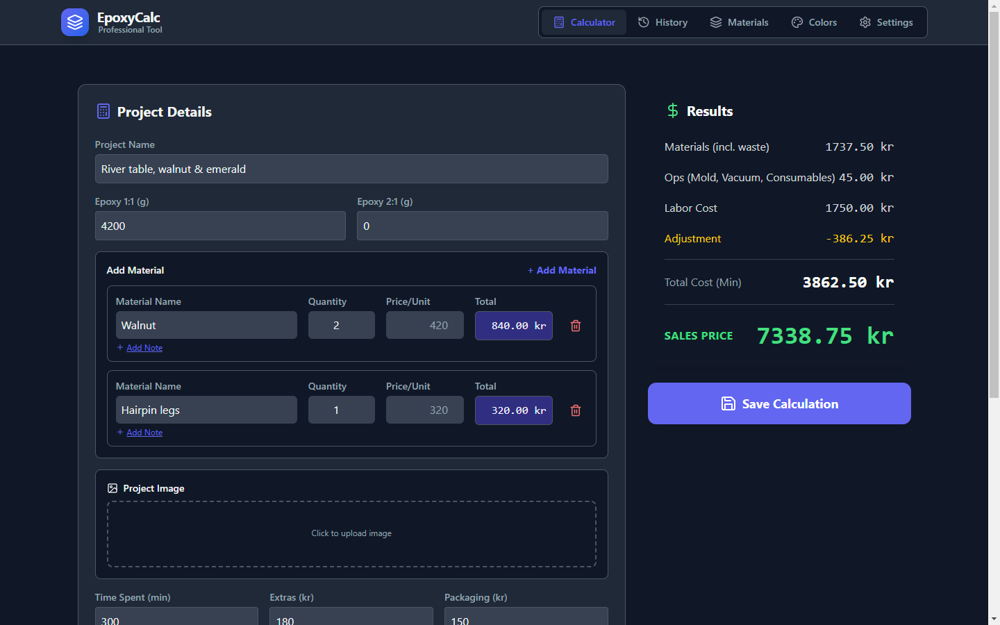
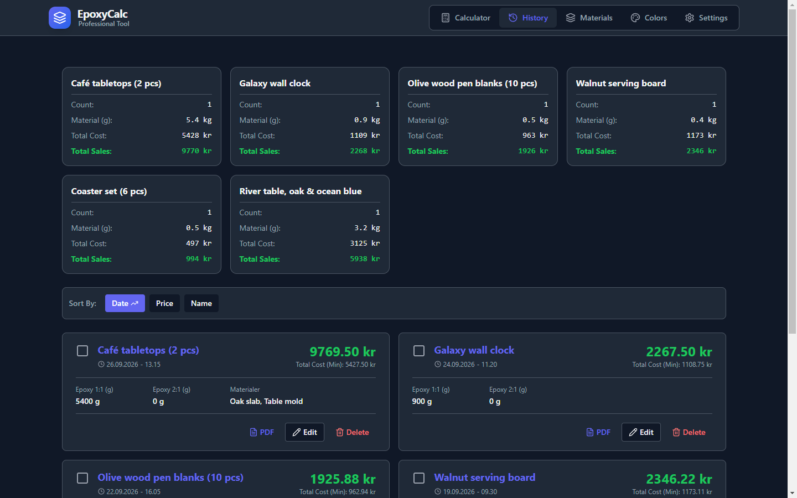
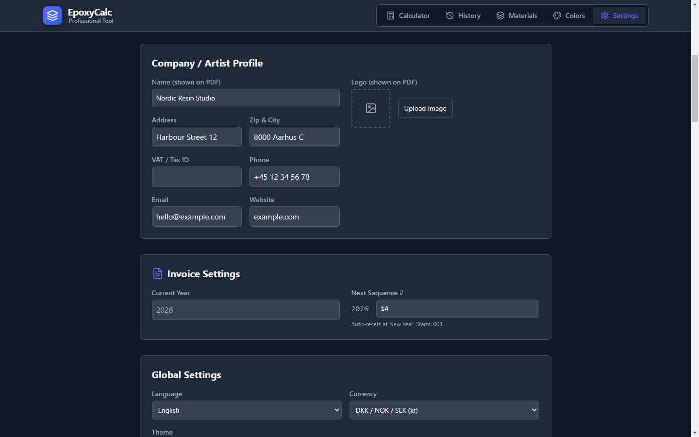
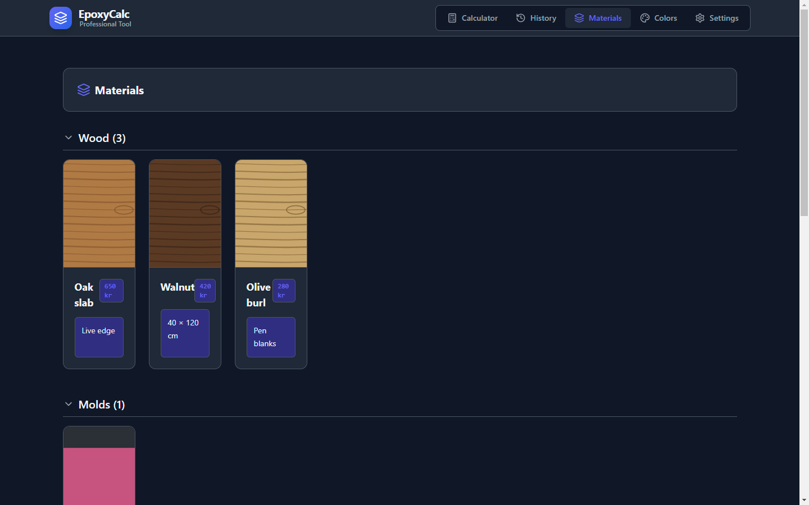
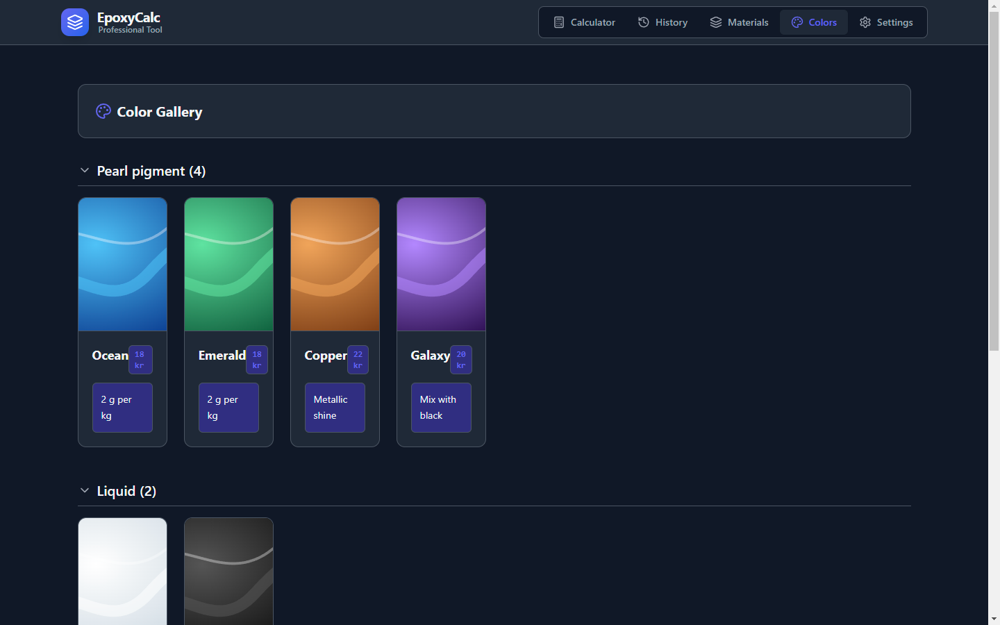
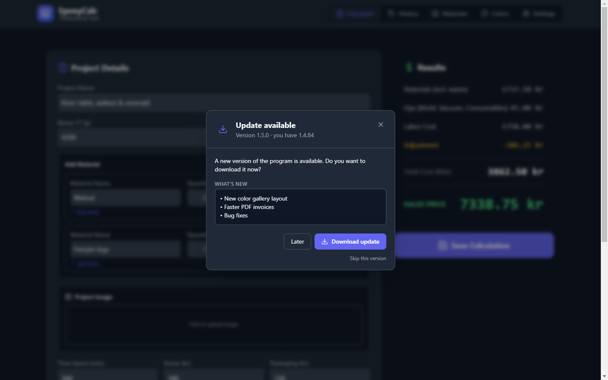

<div align="center">


# Epoxy Calculator

**Price calculation, material and color library, and invoices for epoxy resin casting**


[Download](https://github.com/lartira/Resin-calc/releases/latest) · [Features](#features) · [Patch notes](#patch-notes) · [Development](#development)



</div>

## Download

Get the latest `Epoxy-Calculator-Setup-x.y.z.exe` from [Releases](https://github.com/lartira/Resin-calc/releases/latest) and run it. A new version can be installed over the old one; your data is kept in `Documents\epoxy_data.json` (or the folder you choose under Settings).

From version 1.4.83 the program checks for updates by itself and offers to install them.

## Features

### Calculator

Enter the amount of epoxy, the time spent and any extra materials, and get the cost price and sales price right away.

- **Epoxy 1:1 and 2:1** in grams, each with its own price per kg, plus a waste buffer
- **Materials from your library** such as wood, molds and hardware, with quantity and unit price
- **Operations**: consumables, mold wear, vacuum surcharge and a cost per extra casting
- **Labor, extras and packaging**, and each part can be switched on or off per project
- **Adjustment** as a fixed amount or a percentage (e.g. `-5%` or `+50`) for discounts and rounding
- **Project image**, shown on the invoice, and a **project note** that can be printed on it too

### History and invoices

<table>
<tr>
<td width="50%"></td>
<td width="50%"></td>
</tr>
<tr>
<td>Saved calculations with totals per project, sorting by date, price or name, and <b>PDF invoices</b>. Several projects can be merged into one invoice.</td>
<td><b>Company profile</b> with logo for the invoices, <b>automatic invoice numbers</b> (YYYY-NNN, reset every new year) and a <b>customer directory</b>.</td>
</tr>
</table>

### Material and color library

<table>
<tr>
<td width="50%"></td>
<td width="50%"></td>
</tr>
<tr>
<td><b>Materials</b> with price, pictures and notes, sorted in your own categories such as wood, molds and hardware. Pick them in the calculator by name.</td>
<td><b>Colors and pigments</b> with price and a picture of the result, in your own categories such as mica, liquid pigment and alcohol ink.</td>
</tr>
</table>

### Automatic updates



The program looks for a new version when it starts and every 4 hours. When one is out, a popup shows what's new, downloads it with a progress bar and restarts to install it after saving your data. The popup follows the language of Windows, and a version can be skipped.

### Also included

- Backup and restore of the whole database including pictures, as a zip file
- **Shared database** on OneDrive, Dropbox or a network drive, with "Smart auto-save" that saves locally first and syncs in the background
- 10 languages (Danish, English, Swedish, Norwegian, German, Polish, Czech, Hungarian, Romanian, Bulgarian) and 4 themes (Light, Dark, Ocean, Sunset)
- Your data stays in files you own: no account, cloud service or subscription

## How the price is calculated

| Part | Formula |
|---|---|
| Epoxy | grams 1:1 ÷ 1000 × price 1:1 per kg + grams 2:1 ÷ 1000 × price 2:1 per kg |
| Waste buffer | epoxy × buffer % |
| Materials | quantity × unit price for each material |
| Operations | consumables + mold wear + vacuum surcharge + extra castings × price per casting |
| Labor | minutes ÷ 60 × hourly rate |

**Cost price** = the above + extras + packaging.
**Sales price** = cost price × 2, then the adjustment (fixed amount or %).

## Patch notes

### v1.4.84 · 2026-09-27
- Theme names in Settings are now translated (no more "Mørk / Dark" in English)
- Swedish and Norwegian now show "Tema" instead of a missing text
- New README with screenshots, feature overview and patch notes

### v1.4.83 · 2026-09-27
- The program checks for updates at startup and every 4 hours
- New update popup inside the program with release notes, download progress and "Restart and install"
- The popup is shown in the language of Windows (10 languages), and a version can be skipped
- Fixed: in rare cases outdated data could be saved when closing the program

### v1.4.82 · 2026-09-26
- First release from this repository; updates now come from [lartira/Resin-calc](https://github.com/lartira/Resin-calc)

### v1.4.81 · 2025-12-20
- Saving overhauled to cope with network drive errors (retry, copy fallback and rescue file)
- Custom categories for materials and colors
- Close confirmation so unsaved changes are not lost
- "Force Sync" button and configurable sync interval
- Fixes for PDF header alignment, duplicate entries and false "data corruption" warnings

## Development

Requires Node.js 18+.

```bash
npm install
npm run dev          # Vite + Electron with hot reload
npm run build        # builds the React app into dist/
npm run dist         # Windows installer in dist-electron/
npm run screenshots  # new README screenshots (docs/screenshots) with made-up demo data
```

To test the update popup against a local feed, put a `dev-app-update.yml` next to `package.json` and start the app with `UPDATE_DEV_TEST=1`.

Built with Electron, React, Vite, Tailwind CSS and Lucide icons.
